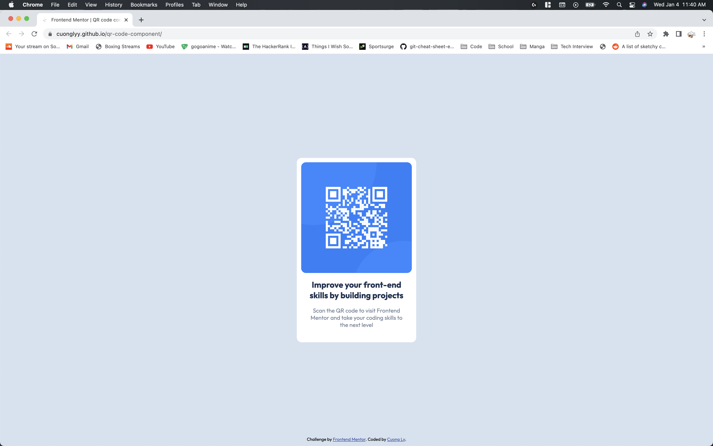

# Frontend Mentor - QR code component solution

This is a solution to the [QR code component challenge on Frontend Mentor](https://www.frontendmentor.io/challenges/qr-code-component-iux_sIO_H). Frontend Mentor challenges help you improve your coding skills by building realistic projects. 

## Table of contents

- [Overview](#overview)
  - [Screenshot](#screenshot)
  - [Links](#links)
- [My process](#my-process)
  - [Built with](#built-with)
  - [What I learned](#what-i-learned)
- [Author](#author)

## Overview

### Screenshot

### Links

- Solution URL: [https://github.com/cuonglyy/qr-code-component](https://github.com/cuonglyy/qr-code-component)
- Live Site URL: [https://cuonglyy.github.io/qr-code-component/](https://cuonglyy.github.io/qr-code-component/)

## My process

### Built with
- Semantic HTML5 markup
- CSS custom properties
- Flexbox

### What I learned

This challenge gave me the opportunity to review my HTML and CSS. I was able to use css variables to make my code cleaner, use Flexbox to position elements neatly, and implement a max-width to the card container to avoid using media quries.

## Author

- Website - [Cuong Ly](https://www.your-site.com)
- Frontend Mentor - [@cuonglyy](https://www.frontendmentor.io/profile/cuonglyy)

